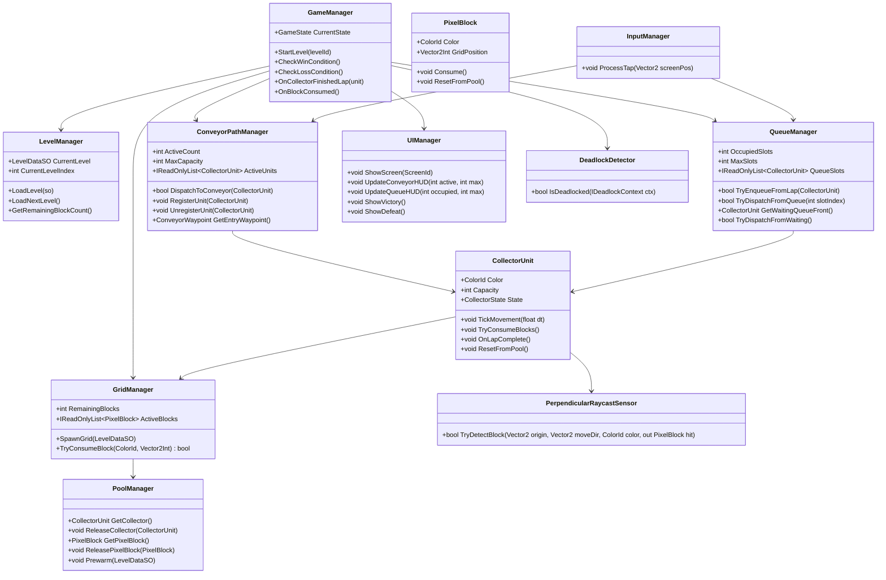
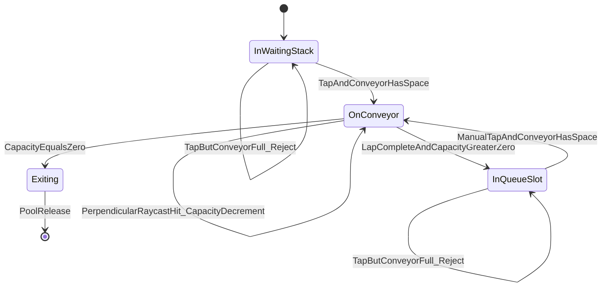
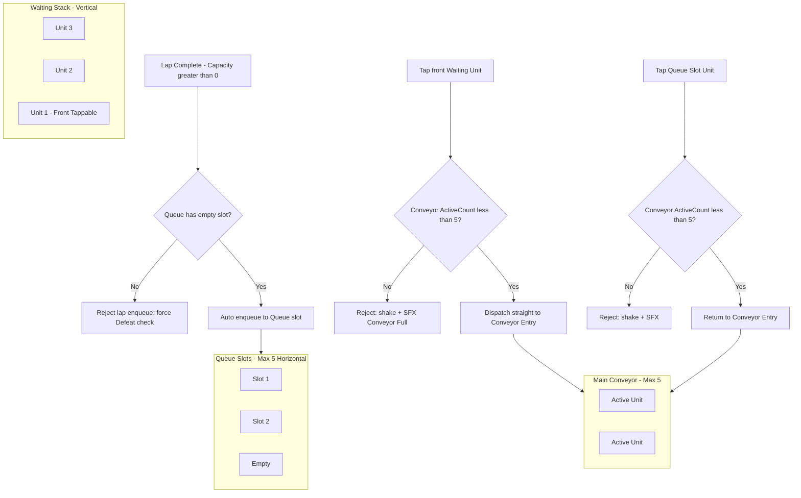
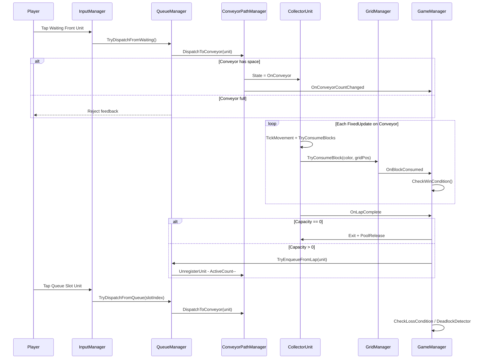

# Pixel Flow Clone — Development Roadmap & Implementation Blueprint

> **Phiên bản tài liệu:** 1.0  
> **Nguồn tham chiếu:** [\[Pixel Flow Clone\]-GDD.md]([Pixel Flow Clone]-GDD.md)  
> **Mục đích:** Blueprint kỹ thuật để triển khai từng task trong Cursor. Mỗi checkbox ở Phần 3 có thể được giao cho Agent implement độc lập.

---

## Phần 0 — Metadata & Conventions

| Hạng mục | Quyết định |
|----------|------------|
| Unity | **2022.3 LTS** (ổn định cho Mobile / WebGL) |
| Render Pipeline | **URP 2D** (khuyến nghị) hoặc Built-in 2D |
| Input | **Unity Input System** (touch + mouse, hỗ trợ đa nền tảng) |
| UI Text | **TextMeshPro** |
| Unit Test | **Unity Test Framework** (NUnit) — Edit Mode cho pure logic, Play Mode cho integration |
| Assembly | `PixelFlowClone` (runtime), `PixelFlowClone.Tests` (test) |

### Quy ước đặt tên

| Loại | Quy ước | Ví dụ |
|------|---------|-------|
| Class / Method | PascalCase | `GridManager`, `TryConsumeBlock` |
| Private field | `_camelCase` | `_activeCount` |
| ScriptableObject class | Suffix `SO` | `LevelDataSO` |
| ScriptableObject asset | PascalCase | `Level_001.asset` |
| Prefab | Prefix `PF_` | `PF_CollectorUnit.prefab` |
| Scene | Prefix `SCN_` | `SCN_Gameplay.unity` |
| Layer (Physics) | PascalCase | `PixelBlock`, `Collector`, `UI` |

### Game-facing strings (tiếng Anh)

Tất cả text hiển thị cho người chơi dùng tiếng Anh:

| Key | Giá trị |
|-----|---------|
| Level label | `"Level {0}"` |
| Conveyor HUD | `"{0}/{1}"` (vd: `"3/5"`) |
| Queue HUD | `"{0}/{1}"` |
| Victory title | `"Victory!"` |
| Defeat title | `"Jammed!"` |
| Defeat subtitle | `"Out of moves"` |
| Button Next | `"Next Level"` |
| Button Retry | `"Retry"` |
| Button Play | `"Play"` |
| Button Pause | `"Pause"` |
| Button Resume | `"Resume"` |
| Button Home | `"Home"` |
| Loading | `"Loading..."` |

---

## 1. TECHNICAL ARCHITECTURE & PROJECT STRUCTURE

### 1.1 Unity Folder Hierarchy

```
Assets/
└── PixelFlowClone/
    ├── Scenes/
    │   ├── SCN_Bootstrap.unity          # DontDestroyOnLoad: Pool, Audio, GameManager shell
    │   ├── SCN_MainMenu.unity
    │   └── SCN_Gameplay.unity
    ├── Scripts/
    │   ├── Core/
    │   │   ├── Singleton.cs
    │   │   ├── GameState.cs
    │   │   ├── GameEvents.cs
    │   │   ├── Bootstrapper.cs
    │   │   └── GameplayContext.cs       # Scene-scoped reference holder
    │   ├── Managers/
    │   │   ├── GameManager.cs
    │   │   ├── LevelManager.cs
    │   │   ├── GridManager.cs
    │   │   ├── ConveyorPathManager.cs
    │   │   ├── QueueManager.cs
    │   │   ├── PoolManager.cs
    │   │   ├── InputManager.cs
    │   │   ├── UIManager.cs
    │   │   └── AudioManager.cs
    │   ├── Entities/
    │   │   ├── PixelBlock.cs
    │   │   ├── CollectorUnit.cs
    │   │   ├── CollectorState.cs
    │   │   └── CollectorStateMachine.cs
    │   ├── Conveyor/
    │   │   ├── ConveyorWaypoint.cs
    │   │   ├── ConveyorPathSO.cs
    │   │   └── PerpendicularRaycastSensor.cs
    │   ├── Queue/
    │   │   ├── WaitingSlotController.cs
    │   │   ├── QueueSlotController.cs
    │   │   └── ITappable.cs
    │   ├── Data/
    │   │   ├── LevelDataSO.cs
    │   │   ├── GameConfigSO.cs
    │   │   ├── GameSettings.cs
    │   │   ├── ColorId.cs
    │   │   └── CollectorSpawnEntry.cs
    │   ├── UI/
    │   │   ├── Screens/
    │   │   │   ├── LoadingScreen.cs
    │   │   │   ├── MainMenuScreen.cs
    │   │   │   └── GameplayHUD.cs
    │   │   └── Popups/
    │   │       ├── SettingsPopup.cs
    │   │       ├── VictoryPopup.cs
    │   │       ├── DefeatPopup.cs
    │   │       └── PausePopup.cs
    │   └── Utils/
    │       ├── DeadlockDetector.cs
    │       ├── IDeadlockContext.cs
    │       └── TapCooldownGate.cs
    ├── Prefabs/
    │   ├── Entities/
    │   │   ├── PF_PixelBlock.prefab
    │   │   └── PF_CollectorUnit.prefab
    │   ├── Conveyor/
    │   │   └── PF_Waypoint.prefab
    │   ├── Systems/
    │   │   └── PF_GameplayContext.prefab
    │   └── UI/
    │       ├── PF_LoadingScreen.prefab
    │       ├── PF_MainMenu.prefab
    │       ├── PF_GameplayHUD.prefab
    │       ├── PF_VictoryPopup.prefab
    │       └── PF_DefeatPopup.prefab
    ├── ScriptableObjects/
    │   ├── Config/
    │   │   └── GameConfig.asset
    │   ├── Paths/
    │   │   └── ConveyorPath_Level01.asset
    │   └── Levels/
    │       ├── Level_001.asset
    │       └── Level_002.asset
    ├── Art/
    │   ├── Sprites/
    │   └── Atlases/
    ├── Audio/
    │   ├── SFX/
    │   └── Music/
    ├── Animations/
    ├── Tests/
    │   ├── EditMode/
    │   │   ├── CapacityLogicTests.cs
    │   │   ├── DeadlockDetectorTests.cs
    │   │   └── QueueStateTests.cs
    │   └── PlayMode/
    │       ├── ConveyorMovementTests.cs
    │       └── LevelLoadTests.cs
    └── Plugins/                         # Chỉ thêm khi cần (vd: DOTween)
```

### 1.2 Class Diagram & Trách nhiệm (OOP)



#### Bảng trách nhiệm chi tiết

| Class | Namespace gợi ý | Trách nhiệm chính |
|-------|-----------------|-------------------|
| `GameManager` | `PixelFlowClone.Managers` | Orchestrator trung tâm. Quản lý `GameState` enum (`Loading`, `Playing`, `Paused`, `Victory`, `Defeat`). Gọi `CheckWinCondition()` / `CheckLossCondition()` sau mỗi sự kiện: block consumed, lap complete, dispatch, queue change. |
| `LevelManager` | `PixelFlowClone.Managers` | Bind `LevelDataSO`, đọc/ghi `PlayerPrefs` cho level progression (`CurrentLevelIndex`). |
| `GridManager` | `PixelFlowClone.Managers` | Deserialize ma trận block từ SO, tính world position (`gridOrigin` + `cellSpacing`), spawn/release qua `PoolManager`. Cung cấp `RemainingBlocks` cho win check. |
| `ConveyorPathManager` | `PixelFlowClone.Managers` | Quản lý closed-loop waypoint graph, `ActiveCount` (max 5), kinematic tick movement, phát hiện lap complete, entry/exit waypoint. |
| `QueueManager` | `PixelFlowClone.Managers` | Vertical waiting stack + 5 horizontal queue slots. Enqueue sau lap, manual dispatch từ queue, tap dispatch từ waiting stack. |
| `CollectorUnit` | `PixelFlowClone.Entities` | Entity runtime: color, capacity label, FSM state, movement, consume logic. Implement `ITappable`. |
| `PixelBlock` | `PixelFlowClone.Entities` | Static grid cell: color sprite, grid index, `Consume()` → pool release. |
| `PerpendicularRaycastSensor` | `PixelFlowClone.Conveyor` | Tính hướng vuông góc với `moveDirection`, `Physics2D.RaycastNonAlloc`, filter layer `PixelBlock`. |
| `PoolManager` | `PixelFlowClone.Managers` | `UnityEngine.Pool.ObjectPool<T>` cho Collector và PixelBlock. Prewarm theo level. |
| `UIManager` | `PixelFlowClone.Managers` | Screen stack, HUD binding qua `GameEvents`, popup lifecycle. |
| `DeadlockDetector` | `PixelFlowClone.Utils` | **Pure static class** — không kế thừa `MonoBehaviour`. Nhận `IDeadlockContext` để unit test không cần scene. |
| `InputManager` | `PixelFlowClone.Managers` | Screen-to-world raycast, resolve `ITappable`, áp `TapCooldownGate`. |
| `GameplayContext` | `PixelFlowClone.Core` | MonoBehaviour trên prefab scene gameplay, serialize references tới scene-scoped managers (tránh over-singleton). |

### 1.3 Collector State Machine



| State | Mô tả | Input được chấp nhận |
|-------|-------|----------------------|
| `InWaitingStack` | Nằm trong hàng dọc chưa xuất phát | Tap (chỉ unit ở **front** của stack) |
| `OnConveyor` | Di chuyển trên băng chuyền, raycast consume | Không tap |
| `InQueueSlot` | Nằm trong 1/5 ô queue ngang sau lap | Tap để dispatch lại |
| `Exiting` | Capacity = 0, đang chạy exit animation | Không tap |
| `Pooled` | Ẩn, trong pool | — |

### 1.4 Luồng Queue & Dispatch (đã xác nhận)

**Quyết định thiết kế:** Tap từ Waiting Stack → **chỉ lên băng chuyền trực tiếp** (không qua Queue làm bước trung gian ban đầu). Queue chỉ nhận unit **sau khi hoàn thành 1 vòng** và `Capacity > 0`. Tái xuất phát từ Queue bằng **Tap thủ công**.



#### Sequence: Một vòng đời Collector điển hình



### 1.5 ScriptableObject Data Schema

#### `ColorId` (enum)

```csharp
public enum ColorId
{
    None = 0,
    Red,
    Blue,
    Green,
    Yellow,
    Purple,
    Orange,
    Pink,
    Black,
    White,
    Brown
}
```

#### `CollectorSpawnEntry` (serializable struct)

```csharp
[System.Serializable]
public struct CollectorSpawnEntry
{
    public ColorId Color;
    public int InitialCapacity;   // Hiển thị trên đầu unit, vd: 10, 17, 20
}
```

#### `LevelDataSO`

```csharp
[CreateAssetMenu(fileName = "Level_", menuName = "PixelFlowClone/Level Data")]
public class LevelDataSO : ScriptableObject
{
    [Header("Identity")]
    public int LevelId;
    public string LevelName;          // Editor only, không hiển thị runtime

    [Header("Pixel Grid")]
    public Vector2Int GridSize;       // vd: (7, 7)
    public ColorId[] BlockMatrix;     // Row-major: index = y * GridSize.x + x
    public Vector2 CellSpacing;       // World units giữa các cell
    public Vector2 GridOrigin;        // World position góc dưới-trái của grid

    [Header("Collectors")]
    public CollectorSpawnColumn[] WaitingColumns; // Mỗi cột độc lập; trong cột: index 0 = back, last = front

    [Header("Conveyor")]
    public ConveyorPathSO PathReference;
}
```

**Quy ước `BlockMatrix`:** `ColorId.None` = ô trống, không spawn block. Validate trong Editor: `BlockMatrix.Length == GridSize.x * GridSize.y`.

#### `ConveyorPathSO`

```csharp
[CreateAssetMenu(fileName = "ConveyorPath_", menuName = "PixelFlowClone/Conveyor Path")]
public class ConveyorPathSO : ScriptableObject
{
    public int EntryWaypointIndex;    // Index waypoint mà unit mới join vào
    public float MoveSpeed;           // Override; 0 = dùng GameConfigSO
    // Waypoint world positions lưu trong scene (ConveyorWaypoint MonoBehaviour children)
    // SO chỉ lưu metadata; path geometry là scene data
}
```

#### `GameConfigSO`

```csharp
[CreateAssetMenu(fileName = "GameConfig", menuName = "PixelFlowClone/Game Config")]
public class GameConfigSO : ScriptableObject
{
    [Header("Capacity Limits")]
    public int MaxConveyorUnits = 5;
    public int MaxQueueSlots = 5;

    [Header("Collector Movement")]
    public float CollectorMoveSpeed = 3f;
    public float LapCompleteEpsilon = 0.05f;

    [Header("Raycast Consume")]
    public float RaycastDistance = 2f;
    public LayerMask PixelBlockLayer;
    public PerpendicularSide RaycastSide = PerpendicularSide.Inward;

    [Header("Input")]
    public float TapCooldownSeconds = 0.15f;

    [Header("Pooling")]
    public int CollectorPoolPrewarm = 20;
    public int BlockPoolPrewarm = 100;
}

public enum PerpendicularSide { Inward, Outward, Left, Right }
```

### 1.6 Design Patterns — Triển khai chi tiết

#### 1.6.1 Singleton Pattern (Managers)

**Phạm vi Singleton:**

| Manager | Scope | DontDestroyOnLoad |
|---------|-------|-------------------|
| `GameManager` | Global | Có |
| `UIManager` | Global | Có |
| `PoolManager` | Global | Có |
| `AudioManager` | Global | Có |
| `InputManager` | Global | Có |
| `GridManager` | Scene (Gameplay) | Không |
| `ConveyorPathManager` | Scene (Gameplay) | Không |
| `QueueManager` | Scene (Gameplay) | Không |
| `LevelManager` | Global | Có |

```csharp
// Assets/PixelFlowClone/Scripts/Core/Singleton.cs
public abstract class Singleton<T> : MonoBehaviour where T : MonoBehaviour
{
    public static T Instance { get; private set; }

    protected virtual void Awake()
    {
        if (Instance != null && Instance != this)
        {
            Destroy(gameObject);
            return;
        }
        Instance = this as T;
        OnSingletonAwake();
    }

    protected virtual void OnSingletonAwake() { }

    protected virtual void OnDestroy()
    {
        if (Instance == this)
            Instance = null;
    }
}
```

```csharp
// Ví dụ sử dụng
public class GameManager : Singleton<GameManager>
{
    protected override void OnSingletonAwake()
    {
        DontDestroyOnLoad(gameObject);
    }
}
```

**`GameplayContext`** — thay vì singleton cho scene managers:

```csharp
public class GameplayContext : MonoBehaviour
{
    public GridManager Grid;
    public ConveyorPathManager Conveyor;
    public QueueManager Queue;

    public static GameplayContext Instance { get; private set; }

    private void Awake() => Instance = this;
    private void OnDestroy()
    {
        if (Instance == this) Instance = null;
    }
}
```

#### 1.6.2 Object Pooling Blueprint

```csharp
// Assets/PixelFlowClone/Scripts/Managers/PoolManager.cs
public class PoolManager : Singleton<PoolManager>
{
    [SerializeField] private CollectorUnit _collectorPrefab;
    [SerializeField] private PixelBlock _blockPrefab;
    [SerializeField] private Transform _collectorPoolRoot;
    [SerializeField] private Transform _blockPoolRoot;

    private ObjectPool<CollectorUnit> _collectorPool;
    private ObjectPool<PixelBlock> _blockPool;

    protected override void OnSingletonAwake()
    {
        DontDestroyOnLoad(gameObject);

        _collectorPool = new ObjectPool<CollectorUnit>(
            createFunc: () => Instantiate(_collectorPrefab, _collectorPoolRoot),
            actionOnGet: unit => { unit.gameObject.SetActive(true); unit.OnSpawnFromPool(); },
            actionOnRelease: unit => { unit.ResetFromPool(); unit.gameObject.SetActive(false); },
            actionOnDestroy: unit => Destroy(unit.gameObject),
            collectionCheck: false,
            defaultCapacity: 20,
            maxSize: 50
        );

        _blockPool = new ObjectPool<PixelBlock>(
            createFunc: () => Instantiate(_blockPrefab, _blockPoolRoot),
            actionOnGet: block => block.gameObject.SetActive(true),
            actionOnRelease: block => { block.ResetFromPool(); block.gameObject.SetActive(false); },
            actionOnDestroy: block => Destroy(block.gameObject),
            collectionCheck: false,
            defaultCapacity: 100,
            maxSize: 200
        );
    }

    public void Prewarm(LevelDataSO level, GameConfigSO config)
    {
        int blockCount = level.BlockMatrix.Count(c => c != ColorId.None);
        int collectorCount = level.CountWaitingCollectors() + config.MaxConveyorUnits + config.MaxQueueSlots;

        for (int i = _collectorPool.CountAll; i < collectorCount; i++)
            _collectorPool.Release(_collectorPool.Get());

        for (int i = _blockPool.CountAll; i < blockCount; i++)
            _blockPool.Release(_blockPool.Get());
    }

    public CollectorUnit GetCollector() => _collectorPool.Get();
    public void ReleaseCollector(CollectorUnit unit) => _collectorPool.Release(unit);
    public PixelBlock GetPixelBlock() => _blockPool.Get();
    public void ReleasePixelBlock(PixelBlock block) => _blockPool.Release(block);
}
```

**Quy tắc bắt buộc:**
- Không gọi `Destroy()` trên `CollectorUnit` / `PixelBlock` trong runtime gameplay.
- `ResetFromPool()` phải zero-out: state, capacity, color, coroutines, trail VFX.
- Khi `ReleaseCollector`, đảm bảo đã `UnregisterUnit` khỏi Conveyor/Queue trước.

#### 1.6.3 Observer Pattern — `GameEvents`

```csharp
public static class GameEvents
{
    public static event System.Action<int, int> OnConveyorCountChanged;  // active, max
    public static event System.Action<int, int> OnQueueCountChanged;       // occupied, max
    public static event System.Action OnBlockConsumed;
    public static event System.Action<CollectorUnit> OnCollectorExited;
    public static event System.Action<CollectorUnit> OnCollectorLapComplete;
    public static event System.Action OnVictory;
    public static event System.Action OnDefeat;
    public static event System.Action OnDeadlockDetected;

    public static void RaiseConveyorCountChanged(int active, int max)
        => OnConveyorCountChanged?.Invoke(active, max);
    // ... tương tự cho các event khác
}
```

#### 1.6.4 State Pattern — `CollectorStateMachine`

```csharp
public class CollectorStateMachine
{
    public CollectorState CurrentState { get; private set; }

    public bool TryTransition(CollectorState target)
    {
        if (!IsValidTransition(CurrentState, target))
            return false;
        CurrentState = target;
        return true;
    }

    private static bool IsValidTransition(CollectorState from, CollectorState to)
    {
        return (from, to) switch
        {
            (CollectorState.InWaitingStack, CollectorState.OnConveyor) => true,
            (CollectorState.OnConveyor, CollectorState.Exiting) => true,
            (CollectorState.OnConveyor, CollectorState.InQueueSlot) => true,
            (CollectorState.InQueueSlot, CollectorState.OnConveyor) => true,
            (CollectorState.Exiting, CollectorState.Pooled) => true,
            _ => false
        };
    }
}
```

### 1.7 Physics & Perpendicular Raycast Spec

#### Rigidbody2D Configuration (`PF_CollectorUnit`)

| Property | Giá trị |
|----------|---------|
| `bodyType` | `Kinematic` |
| `useFullKinematicContacts` | `false` |
| `simulated` | `true` |
| `interpolation` | `Interpolate` (visual smooth) |

#### Movement (trong `CollectorUnit.TickMovement`)

```csharp
// Gọi từ ConveyorPathManager.Update hoặc FixedUpdate
Vector2 target = _waypoints[_currentIndex].Position;
Vector2 pos = _rb.position;
Vector2 dir = (target - pos).normalized;
float step = _speed * deltaTime;

if (Vector2.Distance(pos, target) <= step)
{
    _rb.MovePosition(target);
    AdvanceWaypoint();
}
else
{
    _rb.MovePosition(pos + dir * step);
}

_currentMoveDirection = dir;
```

#### Perpendicular Raycast (trong `PerpendicularRaycastSensor`)

```csharp
public bool TryDetectConsumable(
    Vector2 origin,
    Vector2 moveDirection,
    ColorId collectorColor,
    GameConfigSO config,
    out PixelBlock hitBlock)
{
    hitBlock = null;
    if (moveDirection.sqrMagnitude < 0.001f) return false;

    Vector2 perpendicular = config.RaycastSide switch
    {
        PerpendicularSide.Left  => new Vector2(-moveDirection.y, moveDirection.x),
        PerpendicularSide.Right => new Vector2(moveDirection.y, -moveDirection.x),
        PerpendicularSide.Inward => ComputeInwardNormal(moveDirection),  // Hướng về tâm grid
        _ => new Vector2(-moveDirection.y, moveDirection.x)
    };

    var hit = Physics2D.Raycast(origin, perpendicular, config.RaycastDistance, config.PixelBlockLayer);
#if UNITY_EDITOR
    Debug.DrawRay(origin, perpendicular * config.RaycastDistance, Color.yellow, 0.1f);
#endif
    if (hit.collider == null) return false;

    hitBlock = hit.collider.GetComponent<PixelBlock>();
    return hitBlock != null && hitBlock.Color == collectorColor;
}
```

**Lưu ý:** Hướng tia **luôn vuông góc** với `moveDirection`, không bắn chéo về tâm map. `Inward` tính từ cross product với vector hướng tâm grid.

#### Consume Flow

```
FixedUpdate (OnConveyor only):
  1. PerpendicularRaycastSensor.TryDetectConsumable(...)
  2. Nếu hit + đúng màu:
     a. GridManager.TryConsumeBlock(color, block.GridPosition)
     b. Capacity--
     c. PoolManager.ReleasePixelBlock(block)
     d. GameEvents.RaiseBlockConsumed()
     e. Nếu Capacity == 0 → transition Exiting
```

### 1.8 Deadlock Detection — Pure Logic

```csharp
// Assets/PixelFlowClone/Scripts/Utils/IDeadlockContext.cs
public interface IDeadlockContext
{
    int ConveyorActiveCount { get; }
    int ConveyorMaxCapacity { get; }
    int QueueOccupiedSlots { get; }
    int QueueMaxSlots { get; }
    IReadOnlyList<CollectorSnapshot> ActiveConveyorCollectors { get; }
    IReadOnlyList<BlockSnapshot> RemainingBlocks { get; }
    bool CanCollectorReachBlock(CollectorSnapshot collector, BlockSnapshot block);
}

public readonly struct CollectorSnapshot
{
    public ColorId Color { get; init; }
    public int Capacity { get; init; }
    public Vector2 WorldPosition { get; init; }
    public Vector2 MoveDirection { get; init; }
}

public readonly struct BlockSnapshot
{
    public ColorId Color { get; init; }
    public Vector2 WorldPosition { get; init; }
}
```

```csharp
// Assets/PixelFlowClone/Scripts/Utils/DeadlockDetector.cs
public static class DeadlockDetector
{
    public static bool IsDeadlocked(IDeadlockContext ctx)
    {
        if (ctx.ConveyorActiveCount < ctx.ConveyorMaxCapacity) return false;
        if (ctx.QueueOccupiedSlots < ctx.QueueMaxSlots) return false;
        if (ctx.RemainingBlocks.Count == 0) return false;

        foreach (var collector in ctx.ActiveConveyorCollectors)
        {
            if (collector.Capacity <= 0) continue;

            foreach (var block in ctx.RemainingBlocks)
            {
                if (block.Color != collector.Color) continue;
                if (ctx.CanCollectorReachBlock(collector, block))
                    return false;
            }
        }

        return true;
    }
}
```

**Điều kiện thua:** Collector hoàn thành lap với capacity > 0 nhưng Queue đã đầy → `Defeat` ngay; collector không được chạy thêm lap trên conveyor.

**Không dùng** công thức “Conveyor đầy + Queue đầy + không reachable consume pair” làm điều kiện thua.

**Điểm gọi Defeat:**
- Trong `QueueManager.TryEnqueueFromLap` khi không còn slot trống

---

## 2. STEP-BY-STEP DEVELOPMENT ROADMAP

### Phase 1: Core Mechanics & Physics (The Backbone)

**Mục tiêu Phase:** Scene gameplay tối giản có grid pixel tĩnh, collector chạy kinematic trên conveyor loop, consume block bằng perpendicular raycast, capacity giảm và unit exit khi về 0.

**Tiêu chí hoàn thành Phase 1:**
- [x] Play Mode: 1 level load từ `Level_001.asset`, 1 collector có thể chạy 1 vòng và ăn ít nhất 1 block đúng màu. *(verified: LevelLoadTests + ConveyorMovementTests + consume path `CapacityLogic`/`TryConsumeBlock`; play thủ công trong Play Mode)*
- [x] Không có `Destroy()` runtime trên block/collector. *(Entities không Destroy; chỉ `PoolManager.Release*`; Destroy chỉ pool Clear/overflow/ResetPools — P4-15)*
- [x] `Debug.DrawRay` hiển thị hướng raycast vuông góc trong Scene view.

| # | Task | Kết quả mong đợi | Ghi chú kỹ thuật |
|---|------|------------------|------------------|
| 1.1 | Khởi tạo Unity project | Project URP 2D, folder hierarchy đúng blueprint | Tạo asmdef `PixelFlowClone.Runtime` |
| 1.2 | Physics Layers | Layers: `PixelBlock`, `Collector`, `Default` | Cấu hình Layer Collision Matrix |
| 1.3 | `ColorId`, `CollectorSpawnEntry` | Enum + struct compile | `Scripts/Data/` |
| 1.4 | `GameConfigSO` + asset | Config asset trong `ScriptableObjects/Config/` | Giá trị mặc định theo schema §1.5 |
| 1.5 | `LevelDataSO` + `Level_001` | Asset 5×5, 2 màu, collectors chia rõ theo `WaitingColumns` | Validate `BlockMatrix.Length` trong `OnValidate()` |
| 1.6 | `Singleton<T>` base class | Core infrastructure | `Scripts/Core/Singleton.cs` |
| 1.7 | `PoolManager` + prefabs | `PF_PixelBlock`, `PF_CollectorUnit` spawn/release | Prewarm API |
| 1.8 | `PixelBlock` entity | Sprite theo color, `GridPosition`, `Consume()` | `BoxCollider2D` non-trigger, layer `PixelBlock` |
| 1.9 | `GridManager.SpawnGrid` | Ma trận block hiển thị giữa màn hình | World pos = `GridOrigin + (x * CellSpacing.x, y * CellSpacing.y)` |
| 1.10 | `ConveyorWaypoint` + path scene setup | Closed loop ≥8 waypoints quanh grid | Gizmos vẽ path trong Editor |
| 1.11 | `ConveyorPathSO` + `ConveyorPathManager` | Waypoint traversal, entry index | `ActiveCount` property |
| 1.12 | `CollectorUnit` kinematic setup | `Rigidbody2D` Kinematic, capacity label TMP | `PF_CollectorUnit` prefab |
| 1.13 | `CollectorUnit.TickMovement` | Di chuyển mượt theo waypoints | `MovePosition`, speed từ config |
| 1.14 | Lap complete detection | Event khi quay về entry waypoint | `LapCompleteEpsilon` tolerance |
| 1.15 | `PerpendicularRaycastSensor` | Raycast vuông góc, filter layer | `FixedUpdate` khi `OnConveyor` |
| 1.16 | Consume + capacity decrement | Block destroy (pool), capacity-- | Gọi `GridManager.TryConsumeBlock` |
| 1.17 | Capacity = 0 → exit | `Exiting` state, release pool | `GameEvents.OnCollectorExited` |
| 1.18 | `GameEvents` skeleton | Events cơ bản wired | Conveyor count, block consumed |

---

### Phase 2: Queue Management & Game Loop Logic (The Brain)

**Mục tiêu Phase:** Full game loop — waiting stack, conveyor cap 5/5, queue slots 5/5, tap dispatch, win/loss/deadlock.

**Tiêu chí hoàn thành Phase 2:**
- [x] Có thể thắng khi `RemainingBlocks == 0`.
- [x] Có thể thua khi lap enqueue Queue full (`DeclareDefeat`).
- [x] HUD data events fire đúng (`OnConveyorCountChanged`, `OnQueueCountChanged`).

| # | Task | Kết quả mong đợi | Ghi chú kỹ thuật |
|---|------|------------------|------------------|
| 2.1 | `CollectorStateMachine` | FSM tách khỏi movement | Valid transitions theo §1.3 |
| 2.2 | `ITappable` interface | `void OnTap()` | Implement trên `CollectorUnit` |
| 2.3 | `WaitingSlotController` | Spawn từ các `WaitingColumns` độc lập | Trong mỗi cột: front = last index |
| 2.4 | `QueueSlotController` × 5 | Horizontal slots với world anchors | Index 0–4 |
| 2.5 | `QueueManager` core | API enqueue, dispatch, occupied count | Không chứa UI logic |
| 2.6 | Tap Waiting → Conveyor only | `TryDispatchFromWaiting()` | Guard: `ActiveCount < MaxCapacity` |
| 2.7 | Reject khi conveyor full | Shake animation + return false | Không auto-fallback sang queue |
| 2.8 | Lap complete → auto queue | `TryEnqueueFromLap(unit)` | `ActiveCount--`; Queue full → Defeat |
| 2.9 | Lap complete, capacity = 0 | Exit path, không vào queue | Conveyor slot freed |
| 2.10 | Manual tap Queue → Conveyor | `TryDispatchFromQueue(slotIndex)` | State `InQueueSlot` → `OnConveyor` |
| 2.11 | `InputManager` | Screen tap → world raycast → `ITappable` | Unity Input System `Pointer/press` |
| 2.12 | `GameplayContext` | Scene reference wiring | Inject vào managers cần thiết |
| 2.13 | `GameManager` state machine | `Playing`, `Victory`, `Defeat` | Block input khi không `Playing` |
| 2.14 | `LevelManager` | Load level by index, `PlayerPrefs` | Key: `PFC_CurrentLevel` |
| 2.15 | Win condition | `RemainingBlocks == 0` → `Victory` | Kiểm tra sau mỗi consume |
| 2.16 | `IDeadlockContext` (optional) | Adapter/snapshot helpers | Không dùng cho Defeat |
| 2.17 | `DeadlockDetector` (optional) | Pure static | Không dùng cho Defeat |
| 2.18 | Defeat condition | Queue full khi lap enqueue | `TryEnqueueFromLap` → `DeclareDefeat` |
| 2.19 | ~~`CanCollectorReachBlock`~~ | Cancelled | Không còn điều kiện thua theo reachability |
| 2.20 | ~~`CheckLossCondition` via DeadlockDetector~~ | Cancelled | Defeat đã xử lý ở lap enqueue |
| 2.21 | HUD data events | `OnConveyorCountChanged`, `OnQueueCountChanged` | Chưa cần UI visual polish |

---

### Phase 3: UI/UX, Game Flow & Polish

**Mục tiêu Phase:** Hyper-casual shippable flow — loading, menu, gameplay HUD, popups, anti-spam, juice.

**Tiêu chí hoàn thành Phase 3:**
- [ ] Full flow: Bootstrap → MainMenu → Gameplay → Victory/Defeat → Next/Retry.
- [ ] Tap spam không gây duplicate dispatch.
- [ ] `Time.timeScale = 0` khi pause/popup.

| # | Task | Kết quả mong đợi | Ghi chú kỹ thuật |
|---|------|------------------|------------------|
| 3.1 | `SCN_Bootstrap` | Load persistent managers | `Bootstrapper.cs` |
| 3.2 | Async scene loading | `SCN_MainMenu` via `SceneManager.LoadSceneAsync` | Progress 0–1 |
| 3.3 | `LoadingScreen` | Game title + progress bar + `"Loading..."` | English strings |
| 3.4 | `MainMenuScreen` | Buttons: Play → level pick, Instructions, Settings | Play mở chọn level |
| 3.5 | Level Select grid | Unlock theo `PlayerPrefs`, hiển thị `"Level {0}"` | Key: `PFC_HighestUnlockedLevel`; mở từ Play |
| 3.6 | Settings popup | Audio ON/OFF, Haptic ON/OFF | Keys: `PFC_AudioEnabled`, `PFC_HapticEnabled` |
| 3.7 | `SCN_Gameplay` integration | `GameplayContext` prefab + HUD in scene | `PF_GameplayContext` + `PF_GameplayHUD` |
| 3.8 | `GameplayHUD` — top bar | Pause button, `"Level {0}"` label | |
| 3.9 | `GameplayHUD` — center | Conveyor `"X/5"` indicator | Subscribe `OnConveyorCountChanged` |
| 3.10 | `GameplayHUD` — bottom | Queue count HUD **cancelled** | Waiting/queue units là visual; không hiện `Y/5` |
| 3.11 | `VictoryPopup` | `"Victory!"`, confetti VFX, `"Next Level"` | `timeScale = 0` |
| 3.12 | `DefeatPopup` | `"Jammed!"`, `"Out of moves"`, `"Retry"` | |
| 3.13 | `PausePopup` | Resume, Restart, Home | Restore `timeScale` on Resume |
| 3.14 | `UIManager` screen stack | Show/Hide screens, popup queue | Singleton |
| 3.15 | `TapCooldownGate` | `0.15s` default cooldown | `InputManager.ProcessTap` guard |
| 3.16 | Block consume VFX | ParticleSystem tại block position | Pool optional |
| 3.17 | Collector exit tween | Scale down / fly off trước pool release | Coroutine hoặc DOTween |
| 3.18 | `AudioManager` | SFX: tap, consume, win, lose, reject | `AudioSource` pool |
| 3.19 | Reject feedback | Conveyor full: shake + error SFX | Waiting tap và Queue tap |
| 3.20 | Conveyor belt visual | Sprite tiling / animator optional | Cosmetic only |

---

### Phase 4: Testing & Optimization

**Mục tiêu Phase:** Core logic regression-safe, memory profile ổn định cho mobile.

**Tiêu chí hoàn thành Phase 4:**
- [x] Tất cả Edit Mode tests pass trong Test Runner. *(verified: P4-18 menu / Test Runner — all green)*
- [x] Pool stress test: không GC spike đáng kể sau 100 cycles. *(Play Mode `PoolStressTests` PASS + CountAll ổn định; Profiler Hierarchy frame giữa ~26ms: GC Alloc ~87KB từ ScriptRunDelayed — nhiễu Editor/TestRunner, không Instantiate spike — 2026-07-20)*
- [x] Android hoặc WebGL build compile thành công. *(WebGL smoke OK; Android APK `Builds/Android/android.apk` cài + chạy trên Pixel 7a emulator OK — 2026-07-20)*

| # | Task | Kết quả mong đợi | Ghi chú kỹ thuật |
|---|------|------------------|------------------|
| 4.1 | Test asmdef setup | `PixelFlowClone.Tests` references runtime | NUnit |
| 4.2 | Extract `CapacityLogic` | Pure class tách từ `CollectorUnit` | `TryConsume(capacity, color, blockColor) → newCapacity` |
| 4.3 | `CapacityLogicTests` | `10→9→...→0`, wrong color no-op | Edit Mode |
| 4.4 | `DeadlockDetectorTests` — not deadlocked | Conveyor 3/5, Queue 2/5 → false | Mock context |
| 4.5 | `DeadlockDetectorTests` — deadlocked | Conveyor 5/5, Queue 5/5, no reachable pair → true | Mock context |
| 4.6 | `DeadlockDetectorTests` — reachable pair | Conveyor 5/5, Queue 5/5, 1 red collector + 1 red block reachable → false | Mock `CanCollectorReachBlock` |
| 4.7 | `DeadlockDetectorTests` — empty grid | 0 blocks remaining → false (win, not deadlock) | Edge case |
| 4.8 | `QueueStateTests` — enqueue full | 5 slots occupied → `TryEnqueueFromLap` returns false | Edit Mode |
| 4.9 | `QueueStateTests` — dispatch guard | Conveyor full → `TryDispatchFromQueue` false | |
| 4.10 | `QueueStateTests` — waiting dispatch | Conveyor space → front unit state `OnConveyor` | |
| 4.11 | `LevelLoadTests` (Play Mode) | Spawned block count == non-None cells in SO | |
| 4.12 | `ConveyorMovementTests` (Play Mode) | Unit completes 1 lap trong timeout | |
| 4.13 | Pool stress test manual | 100 spawn/release cycles, Profiler GC | Document kết quả |
| 4.14 | Verify no runtime Destroy | Grep / audit codebase | Chỉ pool release |
| 4.15 | Mobile build settings | Portrait orientation, target API | Android / iOS |
| 4.16 | WebGL build smoke | Build compiles, tap input works | |
| 4.17 | `LevelDataSO` validation tests | Invalid matrix size → editor warning | Optional `[Test]` cho validator |
| 4.18 | CI note (optional) | GitHub Actions `unity-test-runner` doc | Ghi trong README nếu cần |

#### Test Cases mẫu — `DeadlockDetectorTests`

```csharp
[Test]
public void IsDeadlocked_WhenConveyorAndQueueNotFull_ReturnsFalse()
{
    var ctx = new MockDeadlockContext(
        conveyorActive: 3, conveyorMax: 5,
        queueOccupied: 2, queueMax: 5);
    Assert.IsFalse(DeadlockDetector.IsDeadlocked(ctx));
}

[Test]
public void IsDeadlocked_WhenBothFullAndNoReachablePair_ReturnsTrue()
{
    var collectors = new[] {
        new CollectorSnapshot { Color = ColorId.Red, Capacity = 5,
            WorldPosition = Vector2.zero, MoveDirection = Vector2.right }
    };
    var blocks = new[] {
        new BlockSnapshot { Color = ColorId.Blue, WorldPosition = Vector2.up }
    };
    var ctx = new MockDeadlockContext(5, 5, 5, 5, collectors, blocks,
        canReach: (_, _) => false);
    Assert.IsTrue(DeadlockDetector.IsDeadlocked(ctx));
}

[Test]
public void IsDeadlocked_WhenBothFullButRedCanReachRed_ReturnsFalse()
{
    var collectors = new[] {
        new CollectorSnapshot { Color = ColorId.Red, Capacity = 3,
            WorldPosition = Vector2.zero, MoveDirection = Vector2.right }
    };
    var blocks = new[] {
        new BlockSnapshot { Color = ColorId.Red, WorldPosition = Vector2.up }
    };
    var ctx = new MockDeadlockContext(5, 5, 5, 5, collectors, blocks,
        canReach: (c, b) => c.Color == b.Color);
    Assert.IsFalse(DeadlockDetector.IsDeadlocked(ctx));
}
```

---

## 3. ACTIONABLE CHECKLIST FOR CURSOR (TDD-friendly)

> **Cách sử dụng:** Copy từng task hoặc nhóm task vào prompt Cursor, ví dụ: *"Implement Phase 1 task 1.7: PoolManager + prefabs theo planning.md"*. Đánh dấu `[x]` khi hoàn thành.

### Phase 1: Core Mechanics & Physics

- [x] **P1-01** Tạo Unity project 2022.3 LTS URP 2D, root folder `Assets/PixelFlowClone/`
- [x] **P1-02** Tạo assembly definition `PixelFlowClone.Runtime.asmdef`
- [x] **P1-03** Cấu hình Physics Layers: `PixelBlock`, `Collector`
- [x] **P1-04** Implement `ColorId` enum tại `Scripts/Data/ColorId.cs`
- [x] **P1-05** Implement `CollectorSpawnEntry` struct tại `Scripts/Data/CollectorSpawnEntry.cs`
- [x] **P1-06** Implement `GameConfigSO` + tạo asset `ScriptableObjects/Config/GameConfig.asset`
- [x] **P1-07** Implement `LevelDataSO` với `OnValidate()` kiểm tra `BlockMatrix.Length`
- [x] **P1-08** Tạo `ScriptableObjects/Levels/Level_001.asset` (grid 5×5, 2 màu, 3 collectors)
- [x] **P1-09** Implement `Singleton<T>` tại `Scripts/Core/Singleton.cs`
- [x] **P1-10** Implement `GameState` enum tại `Scripts/Core/GameState.cs`
- [x] **P1-11** Implement `GameEvents` static class tại `Scripts/Core/GameEvents.cs`
- [x] **P1-12** Tạo prefab `PF_PixelBlock` (SpriteRenderer + BoxCollider2D + layer `PixelBlock`)
- [x] **P1-13** Tạo prefab `PF_CollectorUnit` (SpriteRenderer + Rigidbody2D Kinematic + TMP capacity label)
- [x] **P1-14** Implement `PixelBlock.cs` với `Color`, `GridPosition`, `Consume()`, `ResetFromPool()`
- [x] **P1-15** Implement `PoolManager.cs` với `ObjectPool<CollectorUnit>` và `ObjectPool<PixelBlock>`
- [x] **P1-16** Implement `PoolManager.Prewarm(LevelDataSO, GameConfigSO)`
- [x] **P1-17** Implement `GridManager.SpawnGrid(LevelDataSO)` — world positioning từ `GridOrigin` + `CellSpacing`
- [x] **P1-18** Implement `GridManager.TryConsumeBlock(ColorId, Vector2Int)` — release block về pool
- [x] **P1-19** Implement `GridManager.RemainingBlocks` property
- [x] **P1-20** Implement `ConveyorWaypoint.cs` với gizmo draw
- [x] **P1-21** Setup closed-loop waypoints trong `SCN_Gameplay` (≥8 điểm bao quanh grid)
- [x] **P1-22** Implement `ConveyorPathSO` ScriptableObject
- [x] **P1-23** Implement `ConveyorPathManager` — waypoint index, `ActiveCount`, entry waypoint
- [x] **P1-24** Implement `CollectorState` enum và `CollectorStateMachine.cs`
- [x] **P1-25** Implement `CollectorUnit.TickMovement(float dt)` dùng `Rigidbody2D.MovePosition`
- [x] **P1-26** Implement lap complete detection (`LapCompleteEpsilon`) + callback `OnLapComplete`
- [x] **P1-27** Implement `PerpendicularRaycastSensor.TryDetectConsumable(...)` với `Physics2D.Raycast`
- [x] **P1-28** Wire consume trong `CollectorUnit.FixedUpdate` khi state `OnConveyor`
- [x] **P1-29** Implement capacity decrement và transition `Exiting` khi capacity == 0
- [x] **P1-30** Implement exit animation stub + `PoolManager.ReleaseCollector(unit)`
- [x] **P1-31** Verify `Debug.DrawRay` hiển thị tia vuông góc trong Scene view

### Phase 2: Queue Management & Game Loop

- [x] **P2-01** Implement `ITappable` interface tại `Scripts/Queue/ITappable.cs`
- [x] **P2-02** Implement `CollectorUnit.OnTap()` theo state hiện tại
- [x] **P2-03** Implement `WaitingSlotController` — spawn collectors từ `LevelDataSO.WaitingColumns`
- [x] **P2-04** Implement `QueueSlotController` — 5 slot anchors, hiển thị unit
- [x] **P2-05** Implement `QueueManager.TryDispatchFromWaiting()` — chỉ front unit, chỉ lên conveyor
- [x] **P2-06** Guard `ConveyorPathManager.DispatchToConveyor`: return false nếu `ActiveCount >= MaxCapacity`
- [x] **P2-07** Implement reject feedback stub (log/SFX placeholder) khi conveyor full
- [x] **P2-08** Implement `QueueManager.TryEnqueueFromLap(CollectorUnit)` — auto assign slot trống
- [x] **P2-09** Decrement `ConveyorPathManager.ActiveCount` khi unit rời conveyor vào queue
- [x] **P2-10** Implement `QueueManager.TryDispatchFromQueue(int slotIndex)` — manual tap re-dispatch
- [x] **P2-11** Implement `InputManager` với Unity Input System (pointer press → world raycast)
- [x] **P2-12** Implement `GameplayContext` prefab `PF_GameplayContext` wire scene managers
- [x] **P2-13** Implement `GameManager` với state machine `Playing/Victory/Defeat`
- [x] **P2-14** Implement `LevelManager.LoadLevel(int index)` + `PlayerPrefs` key `PFC_CurrentLevel`
- [x] **P2-15** Implement `GameManager.CheckWinCondition()` — `RemainingBlocks == 0`
- [x] **P2-16** Implement `IDeadlockContext` interface
- [x] **P2-17** Implement `DeadlockContextAdapter` đọc data từ managers runtime
- [x] **P2-18** Implement `DeadlockDetector.IsDeadlocked(IDeadlockContext)` pure static *(optional; không dùng cho Defeat)*
- [~] **P2-19** ~~Implement `CanCollectorReachBlock`~~ — cancelled (không còn lose theo reachability)
- [x] **P2-20** Defeat khi lap enqueue Queue full (`TryEnqueueFromLap` → `DeclareDefeat`)
- [x] **P2-21** Wire `GameEvents.OnConveyorCountChanged` và `OnQueueCountChanged`
- [x] **P2-22** Test thủ công scenario: tap waiting → conveyor, lap → queue, tap queue → conveyor *(harness: `QueueFlowScenarioTest` Context Menu `P2-22/Run Queue Flow Scenario`)*
- [x] **P2-23** Test thủ công scenario: conveyor full + tap waiting → reject (không vào queue) *(harness: `ConveyorFullRejectScenarioTest` Context Menu `P2-23/Run Conveyor-Full Reject Scenario`)*

### Phase 3: UI/UX & Game Flow

- [x] **P3-01** Tạo `SCN_Bootstrap.unity` với `Bootstrapper.cs` (DontDestroyOnLoad managers)
- [x] **P3-02** Implement async load `SCN_MainMenu` với progress callback
- [x] **P3-03** Implement `LoadingScreen.cs` — title + progress bar + `"Loading..."`
- [x] **P3-04** Tạo `SCN_MainMenu.unity` + `MainMenuScreen.cs`
- [x] **P3-05** Implement nút `"Play"` → chọn level rồi load từ `LevelManager`
- [x] **P3-06** Level Select grid `"Level {0}"` + unlock `PlayerPrefs` (`PFC_HighestUnlockedLevel`)
- [x] **P3-07** Implement Settings: Audio toggle, Haptic toggle → `PlayerPrefs`
- [x] **P3-08** Hoàn thiện `SCN_Gameplay.unity` với `PF_GameplayContext` + HUD
- [x] **P3-09** Implement `GameplayHUD` top bar: Pause + `"Level {0}"`
- [x] **P3-10** Implement `GameplayHUD` conveyor indicator: `"{0}/{1}"` subscribe `OnConveyorCountChanged`
- [x] **P3-11** ~~Queue count HUD~~ — cancelled (không hiện số Queue; waiting/queue units là visual)
- [x] **P3-12** Implement `VictoryPopup` — `"Victory!"`, `"Next Level"`, `timeScale = 0`
- [x] **P3-13** Implement `DefeatPopup` — `"Jammed!"`, `"Out of moves"`, `"Retry"`
- [x] **P3-14** Implement `PausePopup` — Resume, Restart, Home
- [x] **P3-15** Implement `UIManager` screen stack + popup show/hide API
- [x] **P3-16** Implement `TapCooldownGate` (default `0.15s`) trong `InputManager.ProcessTap`
- [x] **P3-17** Implement block consume ParticleSystem VFX
- [x] **P3-18** Implement collector exit tween trước `ReleaseCollector`
- [x] **P3-19** Implement `AudioManager` với SFX: tap, consume, win, lose, reject
- [x] **P3-20** Implement reject shake animation trên `CollectorUnit` khi dispatch fail

### Phase 4: Testing & Optimization

- [x] **P4-01** Tạo `PixelFlowClone.Tests.asmdef` reference runtime assembly
- [x] **P4-02** Extract `CapacityLogic` pure class từ consume logic
- [x] **P4-03** Viết `CapacityLogicTests` — decrement đúng, wrong color không giảm
- [x] **P4-04** Viết `DeadlockDetectorTests.NotDeadlocked_WhenConveyorNotFull`
- [x] **P4-05** Viết `DeadlockDetectorTests.NotDeadlocked_WhenQueueNotFull`
- [x] **P4-06** Viết `DeadlockDetectorTests.IsDeadlocked_WhenBothFull_NoReachablePair`
- [x] **P4-07** Viết `DeadlockDetectorTests.NotDeadlocked_WhenBothFull_HasReachablePair`
- [x] **P4-08** Viết `DeadlockDetectorTests.NotDeadlocked_WhenNoBlocksRemaining`
- [x] **P4-09** Viết `QueueStateTests.EnqueueFails_WhenAllSlotsOccupied`
- [x] **P4-10** Viết `QueueStateTests.DispatchFromQueueFails_WhenConveyorFull`
- [x] **P4-11** Viết `QueueStateTests.DispatchFromWaiting_Succeeds_WhenConveyorHasSpace`
- [x] **P4-12** Viết `LevelLoadTests` (Play Mode) — block count khớp SO
- [x] **P4-13** Viết `ConveyorMovementTests` (Play Mode) — lap complete trong timeout
- [x] **P4-14** Chạy pool stress test 100 cycles, ghi nhận Profiler GC alloc *(harness: `PoolStressTests`; warm pool → 100 get/release; CountAll ổn định; Profiler: flat GC Alloc sau warm-up)*
- [x] **P4-15** Audit codebase: không có `Destroy()` trên Collector/Block trong gameplay *(Entities không Destroy; PoolManager chỉ Destroy ở Clear/overflow/ResetPools)*
- [x] **P4-16** Cấu hình Android build settings (portrait, IL2CPP optional)
- [x] **P4-17** WebGL build smoke test *(menu: `Apply WebGL Build Settings` + `Build WebGL Smoke` → `Builds/WebGL_Smoke`; verify click/tap waiting pig via local HTTP server)*
- [x] **P4-18** Chạy toàn bộ Edit Mode tests — tất cả pass *(menu: `PixelFlowClone → Run All Edit Mode Tests (P4-18)` hoặc Test Runner → EditMode → Run All; assembly `PixelFlowClone.Tests`: CapacityLogic / Deadlock / QueueState / PoolLifecycle)*

---

## Phụ lục A — Rủi ro & Quyết định thiết kế

| Chủ đề | Quyết định |
|--------|------------|
| Dispatch từ Waiting Stack | Chỉ thẳng lên Conveyor (đã xác nhận với stakeholder) |
| Conveyor đầy khi tap Waiting | Reject + feedback; **không** auto-fallback sang Queue |
| Queue entry | Chỉ sau lap complete khi `Capacity > 0` |
| Re-dispatch | Tap thủ công trên unit trong Queue slot |
| Consume mechanism | Perpendicular `Physics2D.Raycast`, không dùng Dynamic collision |
| Defeat | Lap enqueue gặp Queue full (capacity > 0). Không dùng deadlock reachable-pair. |
| Singleton scope | Global: Game, UI, Pool, Audio, Input, Level; Scene: Grid, Conveyor, Queue |
| Object lifecycle | Pool only — không `Destroy()` runtime cho Collector và PixelBlock |

## Phụ lục B — Thứ tự implement khuyến nghị cho Cursor

1. **P1-01 → P1-19** (Data + Pool + Grid) — nền tảng spawn level
2. **P1-20 → P1-31** (Conveyor + Raycast) — core fun loop
3. **P2-01 → P2-23** (Queue + Game loop) — game hoàn chỉnh logic
4. **P3-01 → P3-20** (UI/UX) — shippable product
5. **P4-01 → P4-18** (Tests + Optimization) — production hardening

---

*Tài liệu này là living document. Cập nhật version khi có thay đổi thiết kế.*
